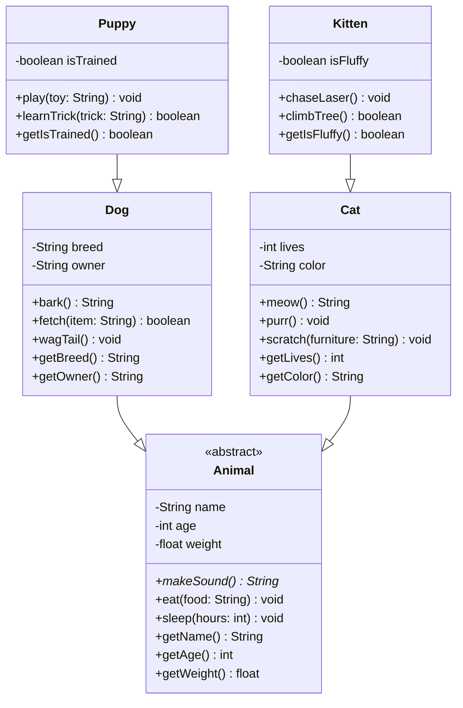

# Тестовые примеры для TWD API Helper

## 1. Тест исправления раскладки (KeyboardLayoutFixer)

// Выдели текст и нажми Ctrl+Shift+L или кнопку в панели

Текст для исправления: `ghbdtn` → должно стать "привет"

Текст для исправления: `руддщ` → должно стать "hello"

## 2. Тест команд редактирования (TextEditorHelper)

// Выдели текст и вызови команду из палитры или панели

Обернуть в кавычки: пример текста → «пример текста»         // TWD Wrap

Обернуть в тег <b>: жирный текст → <b>жирный текст</b>      // TWD Wrap

В верхний регистр: нижний регистр → НИЖНИЙ РЕГИСТР          // TWD to UPPERCASE

## 3. Тест фолдинга (HtmlTagFoldingProvider)

// Должны сворачиваться через панель "Демо Панель"

<folding-start>

Вложенный блок. Сворачивается отдельно.

<folding-start>

Вложенный вложенный блок

<folding-start>

Этот блок должен сворачиваться

Многострочное

Содержимое

<folding-end>

Многострочное

Содержимое

<folding-end>

<folding-end>

## 4. Тест сниппетов (SnippetInserter)

// Вызови команды вставки сниппетов из палитры или через `Ctrl + Space`

// Вставь сниппет из команды. TWD Insert

// Вставь сниппет через `Ctrl + Space`

## 5. Тест hover-подсказок (BlockTypeHintProvider, ComponentHintProvider)

// Наведи курсор на тригеры `:::warning` и `<Card>`

:::warning - появится подсказка про warning блок

<Card> - появится ссылка на документацию компонента

:::

## 6. Тест MDX блоков (SimpleDecorator)

// Эти блоки должны подсвечиваться цветом

:::note

Это блок note (желтая подсветка)

:::info  

Это блок info (синяя подсветка)

:::

:::warning - появится подсказка про warning блок

<Card> - появится ссылка на документацию компонента

:::

:::

:::info  

Это блок info (синяя подсветка)

:::

:::info  

Это блок info (синяя подсветка)

:::

## 7. Подсветка синтакисиса

Откройте файл `Animal.mmd` для проверки подсветки в ассоциированных файлах.

Подсветка в блок коде:

